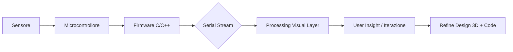

<!-- ========== HERO BANNER ========== -->
<div align="center">
  <!-- Banner SVG Gradient -->
  
  
  <!-- Animated Typing -->
  <a href="https://git.io/typing-svg">
    
  </a>

  <!-- Mini Logo (SVG inline) -->
  
      <defs>
        <linearGradient id='g' x1='0%' y1='0%' x2='100%' y2='100%'>
          <stop stop-color='#15c2ff' offset='0'/>
          <stop stop-color='#ff7e29' offset='1'/>
        </linearGradient>
        <filter id='glow'>
          <feGaussianBlur stdDeviation='3.5' result='coloredBlur'/>
          <feMerge>
            <feMergeNode in='coloredBlur'/>
            <feMergeNode in='SourceGraphic'/>
          </feMerge>
        </filter>
      </defs>
      <rect rx='14' ry='14' x='4' y='4' width='172' height='102' fill='#0e0f10' stroke='url(#g)' stroke-width='2'/>
      <text x='50%' y='52%' font-size='40' text-anchor='middle' fill='url(#g)' font-family='JetBrains Mono' filter='url(#glow)'>N</text>
      <text x='50%' y='86%' font-size='14' text-anchor='middle' fill='#ffffff' font-family='Inter'>embedded • creative</text>
    </svg>" />
  
  <h1 style="margin-top:6px;">🛠️ Nilus</h1>
  <p><strong>Studente @ I.T.I.S. Magistri Cumacini (CO)</strong><br/>
  <em>Low-Level | Sensor Fusion | Visual Reactive Interfaces | 3D Functional Design</em></p>
  
  <!-- Badge Strip -->
  
  
  
  
  
</div>

<!-- Decor Separator -->
<div align="center">
  
</div>

---

### 🔥 Visione
Trasformare segnali fisici (luce, distanza, suono) in visualizzazioni dinamiche, interfacce reattive e prototipi robusti racchiusi in case stampati in 3D su misura. Il codice non è fine a sé stesso: è il ponte tra hardware e percezione.

---

### 🧬 Stack / Skillset
| Dominio | Dettagli | Stato |
|---------|----------|-------|
| Low-Level | C, C++, Assembly, gestione timing / interrupt | Solido |
| Embedded | Arduino, I2C, SPI, Serial pipeline | Attivo |
| Prototipazione | Modellazione + Stampa 3D (supporti, case) | Costante |
| Visual Coding | Processing (grafica reattiva, gauge, chart) | In crescita |
| Web Base | HTML/CSS (control panel, UI essenziali) | Disponibile |
| In Apprendimento | Java (struttura + OOP) | Progressivo |

> Palette attuale: Neon Tech (#15c2ff → #ff7e29). Alternative: Synthwave (#ff00c8 → #00e1ff), Terminal (#43ff9e → #2ecf73). (Posso generare variant theme se vuoi.)

---

### 🚧 Roadmap Progetti (Showcase)
| # | Nome | Fase | Core Idea | Tech | Prossimo Step |
|---|------|------|-----------|------|---------------|
| 1 | Serial Viz Deck | Concept | Dashboard Processing multi-sensore con gradienti adaptivi | Processing + Arduino | Prototipo gauge + smoothing |
| 2 | Modular Sensor HAL | Design | Layer astratto uniforme per sensori, callback modulare | C++ | Definire interfacce base |
| 3 | Reactive LED Wall | Prototype | Input audio/gesti → pattern generativi LED | Arduino + FFT | Test intensità + filtri |
| 4 | 3D Bench Helpers | WIP | Set stampato per ordine moduli / cablaggi | CAD + 3D Print | Iterare layout |
| 5 | Hybrid WebSerial Panel | Idea | Panel locale HTML per stream live (senza IDE) | HTML + JS (WebSerial) | Ricerca compatibilità browser |

---

### 📡 Pipeline Concettuale


---

### 🧠 Filosofia & Principi
- “La complessità è carburante, non ostacolo.”
- Modularità prima dell’ottimizzazione micro.
- Documentazione come parte del ciclo (non posticipata).
- Visual Feedback = debugging accelerato.

---

### 🎛️ Focus Attuale
| Area | Attività | Perché |
|------|----------|--------|
| Sensor Fusion | Unire più feed analogici in una sola UI | Comparare fenomeni |
| Smoothing / Filtering | Curve più stabili | Rilevanza > rumore |
| Case 3D puliti | Ridurre caos del banco | Ripetibilità setup |
| Visual Patterns | Feedback immediato | Interazione umana migliore |

---

### 📊 Stats
<div align="center">
  
  
</div>
<div align="center">
  
</div>

---

### 🏆 Trophies
<div align="center">
  <a href="https://github.com/ryo-ma/github-profile-trophy">
    
  </a>
</div>

---

### 🎨 Badge / Holopin
<!-- Quando avrai il tuo profilo Holopin, sostituisci l'URL -->
<p align="center">
  <a href="https://holopin.io/@TUO_HANDLE"></a>
</p>

---

### 💡 Snippet (Esempio: mini engine visual + smoothing)
```cpp
// Minimo wrapper sensore + mapping colore per dashboard Processing
struct AnalogChannel {
  uint8_t pin;
  float filtered = 0;
  uint16_t raw = 0;

  void init() { pinMode(pin, INPUT); }

  void sample() {
    raw = analogRead(pin);
    filtered = 0.80f * filtered + 0.20f * raw; // EMA smoothing
  }

  float norm() const { return filtered / 1023.0f; }

  uint32_t gradientColor() const {
    // Ciano → Arancio (hex: 0x15c2ff → 0xff7e29)
    float t = norm();
    uint8_t r1=0x15, g1=0xC2, b1=0xFF;
    uint8_t r2=0xFF, g2=0x7E, b2=0x29;
    uint8_t r = r1 + (r2 - r1) * t;
    uint8_t g = g1 + (g2 - g1) * t;
    uint8_t b = b1 + (b2 - b1) * t;
    return (uint32_t)r<<16 | (uint32_t)g<<8 | b;
  }
};

AnalogChannel light{A0};
AnalogChannel temp{A1};

void setup() {
  Serial.begin(115200);
  light.init(); temp.init();
}

void loop() {
  light.sample();
  temp.sample();
  Serial.print("L:"); Serial.print(light.raw);
  Serial.print(",T:"); Serial.print(temp.raw);
  Serial.print(",CL:"); Serial.print(light.gradientColor(), HEX);
  Serial.print(",CT:"); Serial.println(temp.gradientColor(), HEX);
  delay(10);
}
```

---

### 📈 Progress Bars (Learning Momentum)
| Area | Avanzamento | Barra |
|------|-------------|-------|
| Processing UI | 10% | ███░░░░░░░░░░░░░ |
| Java Base | 40% | ██████░░░░░░░░ |
| Sensor Abstraction | 55% | █████████░░░░ |
| Case 3D Iterativi | 70% | ███████████░░ |
| Multi-Sensor Dashboard | 30% | ███░░░░░░░░░ |


---

### 🧭 Timeline Crescita (Sintetica)
| Periodo | Evoluzione |
|---------|------------|
| 2023 | Prime interfacce embedded e uso base Arduino |
| 2024 | Astrazione sensori, smoothing, stampa 3D funzionale |
| 2025 (Now) | Collegamento firmware ↔ visual live (Processing) |
| 2026 (Goal) | Dashboard autonoma + libreria modulare + showcase installazione |

---

### 🔮 Espansioni Future
| Idea | Value | Trigger |
|------|-------|---------|
| WebSerial Panel | UI accessibile da browser | Dashboard stabile |
| LED Matrix Pattern Engine | Effetti parametrici generativi | Reactive Wall MVP |
| CAD Modular System | Case magnetico modulare | 3 sensori frequenti |
| Minimal Sensor SDK | Condivisione / open source | Code base pulita |

---

### 📷 Media & Visual (Placeholder)
Inserirai:
1. Foto banco prototipi (light diffuso, top-down)
2. GIF gauge Processing reattiva
3. Case 3D per un sensore (prima / dopo)
4. Led Wall pattern (video corto)


---

### 🌐 Contatto & Social
<p align="center">
  <a href="https://instagram.com/yvng.nilus">Instagram</a> •
  <a href="mailto:00k.niluss@gmail.com">Business Email</a> •
  <a href="https://github.com/Nilussss">GitHub</a>
</p>

---


<div align="center">
  
  <em>“Build • Visualize • Iterate.”</em>
</div>
